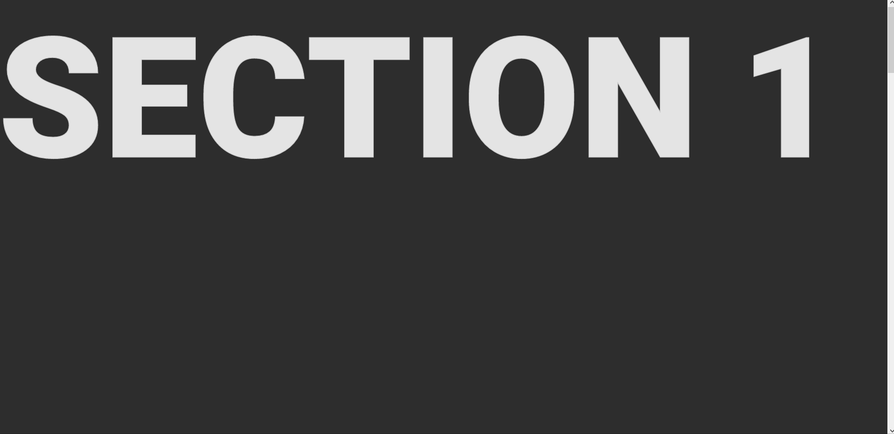

# Fancy Sticky headers

Example HTML and CSS to create stylized sticky headers similar to those seen in the 5th example website in the following youtube video [youtube video!](https://www.youtube.com/watch?v=slDybGJI1Ao)

See the code in action [HERE!](https://www.mikenyoung.com/css-sticky-headers)!

#Demo

